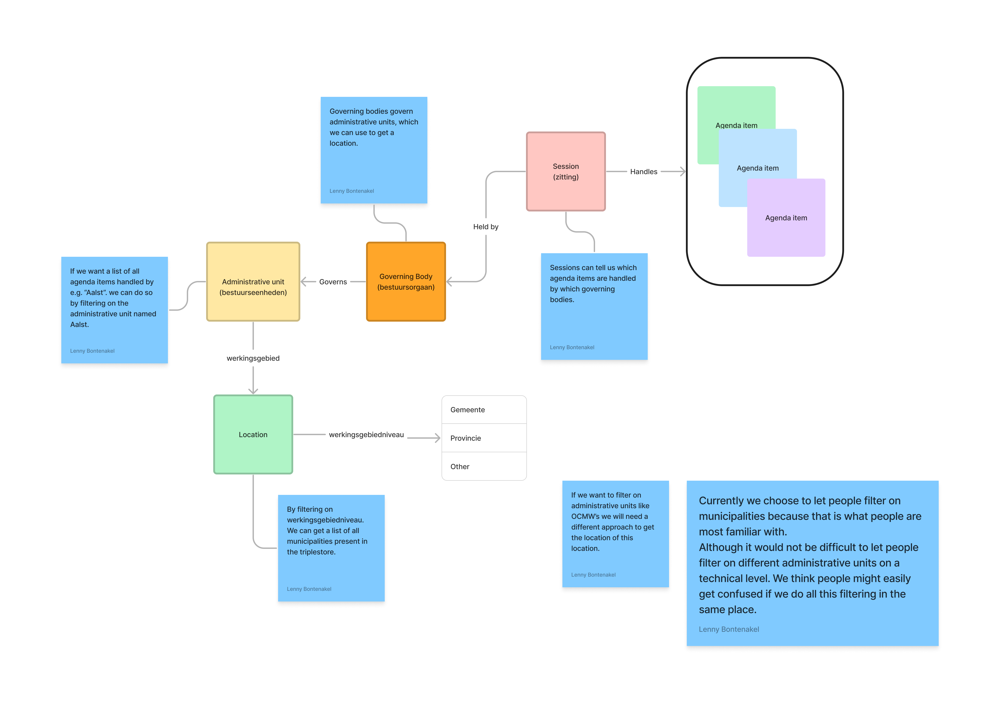

# BurgerNabijeBesluitendatabank (front-end)

[The front-end for BNB](https://burgernabije-besluitendatabank-dev.s.redhost.be/), a site that uses linked data to empower everyone in Flanders to consult the decisions made by their local authorities.

You can check out more info on besluitendatabanken [here](https://lokaalbestuur.vlaanderen.be/besluitendatabank), and the [app repo](https://github.com/lblod/app-burgernabije-besluitendatabank) here. The app repo will also contain general project information; this repo should only contain information needed specifically for the front-end itself.

## Tutorial: Getting Started

### Prerequisites

- [Node.js](https://nodejs.org/) v10 or later
- [Ember CLI](https://www.npmjs.com/package/ember-cli) v3.15 or later

### Installation

```bash
git clone https://github.com/lblod/frontend-burgernabije-besluitendatabank
cd frontend-burgernabije-besluitendatabank
npm install
```

From there, you can use `npm run dev:proxy`, or any of the following npm scripts:


|  npm run...  |  Description |
| ------------ | ------------ |
| build        | Creates a production-ready static build |
| lint         | Runs the linter and returns any errors/warnings. *Is run automatically before committing, cancelling the commit on error* |
| lint:fix     | Runs the linter, attempting to automatically fix any errors |
| dev          | Run a development server with the mock api |
| dev:proxy    | Run a development server with a proxy to [the external dev server](https://burgernabije-besluitendatabank-dev.s.redhost.be/) |
| start        | Run a development server with the mock api |
| prod         | Run a production server |
| test         | Run the linter and then ember tests |


### Automated builds

The project uses woodpecker to automate builds. The configuration files can be found in the `.woodpecker` folder. Builds are available [here](https://build.redpencil.io/lblod/frontend-burgernabije-besluitendatabank/).

- Latest master build : `lblod/frontend-burgernabije-besluitendatabank:latest` 
- Feature branch build : `lblod/frontend-burgernabije-besluitendatabank:feature-<branch-name>`
- Version tag build : `lblod/frontend-burgernabije-besluitendatabank:<version-tag>` tag like v1.2.3 would be published as 1.2.3 (so the v is dropped)


## Reference
### styles/ naming scheme
Ember works by outputting one big CSS file. This results in only needing one request for all styling (good for the end users) but also that every css you write for a route will always apply (ouch for the developers). To prevent duplicate ID's goofing things up and the .scss file becoming unreadable, The following structure has been set.

- [app.scss](app/styles/app.scss): File that will be output. HTML tag styling & imports are done here.
- [_au-overrides.scss](app/styles/_au-overrides.scss): Overrides for appuniverse components
- [_custom-classes.scss](app/styles/_custom-classes.scss): Custom classes that are meant to be used across the application
- [components/_*.scss](app/styles/components/)
    - One scss file per [component](app/components/)
    - Use the following selector structure `.component-COMPONENT-NAME` (make sure you use a class selector, as components may be reused on the same page)
- [routes/_*.scss](app/styles/routes/)
    - One scss file per [route](app/routes/)
    - Use the following selector structure `#route-ROUTE-NAME`
        - Use an ID, ideally applied to the top-most element of the route
        - For further SCSS rules that need to apply to this specific route, write them as follows:
            ```scss
            #route-ROUTE-NAME { 
                .header {
                    /* ... */
                }
                p {
                    /* ... */
                }
            }
            ```
            This is to ensure it only applies to this route. If the styling should apply to multiple routes, it should be a [custom class](app/styles/_custom-classes.scss) or [element style](app/styles/app.scss) instead


## Discussions

### Data Alignment

Due to the intricacies of levels of Flemish bureaucratic units a data alignment meeting had to be planned.
The reason for this confusion was due to the levels of municipal governance in Flanders. After properly outlining the importance and nuance of each level it was decided that citizens should be able to see both the administrative unit.
The levels are as follows:

- Governing Body (Bestuursorgaan) (Algemene Vergadering Boom Plus)
- Administrative Unit (Bestuurseenheid) (Boom Plus)
- Location (Boom)




